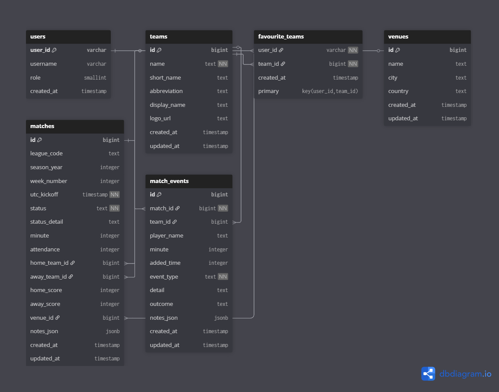

# Database Documentation

## 1. Schema

We designed a relational database using **Supabase**, which is built on PostgreSQL. Below is the database schema for our live sports feed web app:

### Tables Overview

#### `users`

- Stores basic user information
- **Primary key**: `user_id`

#### `teams`

- Contains metadata about each sports team including name, short name, and logo
- **Primary key**: `id`

#### `favourite_teams`

- Join table that links users to teams they've marked as favourites
- **Composite primary key**: `(user_id, team_id)`
- Foreign keys to `users` and `teams`

#### `matches`

- Stores match metadata, such as kickoff time, scores, and the teams involved
- Tracks match status and related venue
- **Primary key**: `id`
- Foreign keys: `home_team_id`, `away_team_id`, `venue_id`

#### `match_events`

- Stores in-game events like goals, fouls, substitutions, etc.
- Includes time, player name, event type, and optional notes
- **Primary key**: `id`
- Foreign keys: `match_id`, `team_id`

#### `venues`

- Stores information about stadiums or match venues
- **Primary key**: `id`

---

## 2. Deployment

We chose **Supabase** to host our database because it offers a robust and developer-friendly PostgreSQL environment that’s well-suited for real-time, relational applications like ours. Since our app relies heavily on structured data such as users, teams, matches, and events. A relational database was essential, and Supabase provides this with minimal setup and solid reliability.

- **Hosting Platform:** Supabase
- **Database Engine:** PostgreSQL
- **Backend Hosting:** [Render](https://render.com)

Our backend is deployed on **Render**, and it communicates securely with Supabase using environment variables to manage the database connection. This setup allows us to separate our application logic (hosted on Render) from our data layer (hosted on Supabase), making our architecture both modular and easy to scale.
